# Primera parte de la práctica

## Creación del README.md

Antes de nada durante toda la práctica usaré distintos alias. Por ejemplo para commit -m crée el alias comm. Para log --one-line logone. c

Ahora sí creamos el readme.md .

## Commit inicial

Hacemos un commit con el mensaje "Comenzamos con los ejercicios de Git"

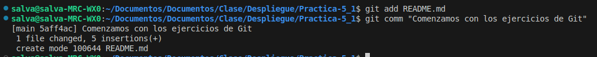

## Push inicial

Subimos los cambios al repositorio remoto con el comando `git push`

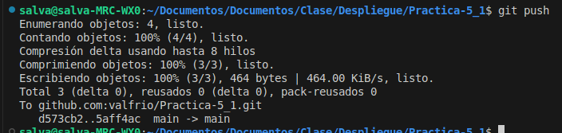

## Ignorar archivos

Creamos un archivo llamado privado.txt en la carpeta privada y lo añadimos al .gitignore

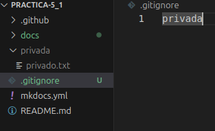

## Añadir fichero 1.txt, crear el tag y subirlo

Añadimos el fichero, creamos el tag usando el comando `git tag v0.1` y subimos los cambios al repositorio remoto.

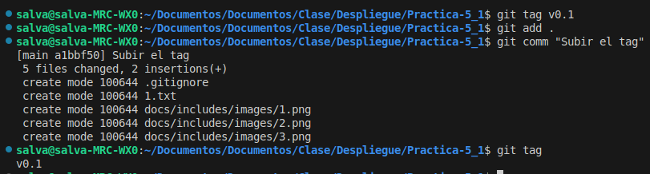

## Cuenta de github

Para ello debemos de ir a ajustes, a perfil y modificar la foto de perfil. Para el doble factor
de autenticación debemos de activar la clave ssh. Para ello debemos de generar una clave, añadirla al agente
del ordenador y por último pasar la clave pública a github. [Link a los distintos tutoriales que seguí para hacerlo](https://docs.github.com/es/authentication/connecting-to-github-with-ssh).

AHora si adjunto foto de mi cuenta con el doble factor de autenticación activado.

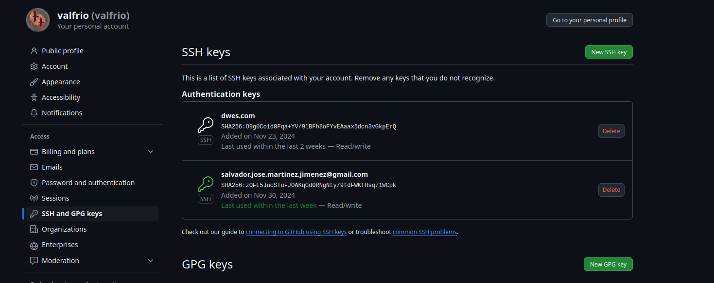

## Uso social de github

Busco en la lupa el nombre de mis compañeros y les sigo.

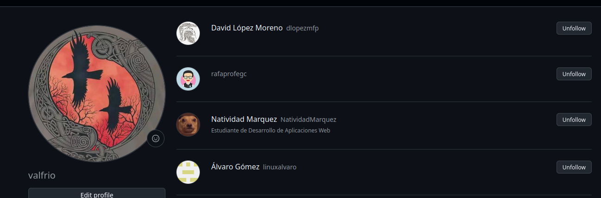

Seguir los repositorios y darle una estrella:

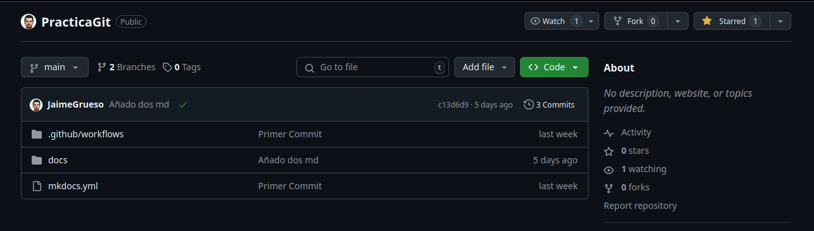

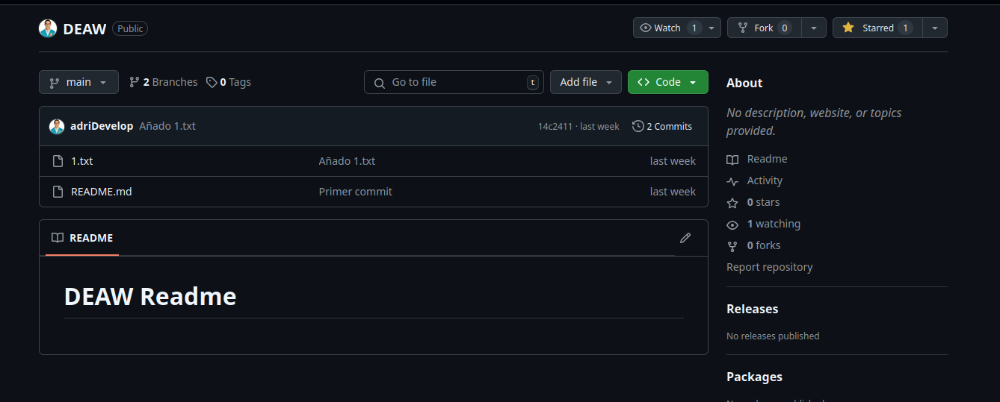

## Crear una tabla

Para ello debemos usar markdown. El formato es simple | para separar columnas y - para las filas.

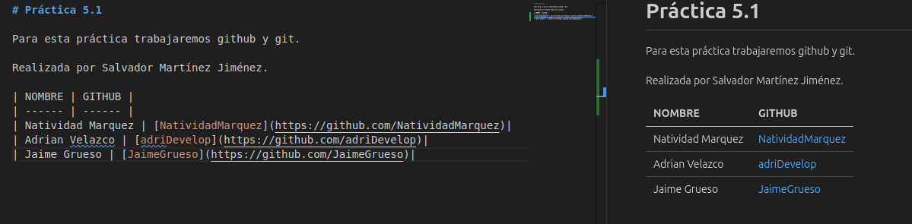

## Colaboradores

Para añadir colaboradores debemos de ir a ajustes, a colaboradores y añadir el nombre de usuario de la persona que queremos añadir.

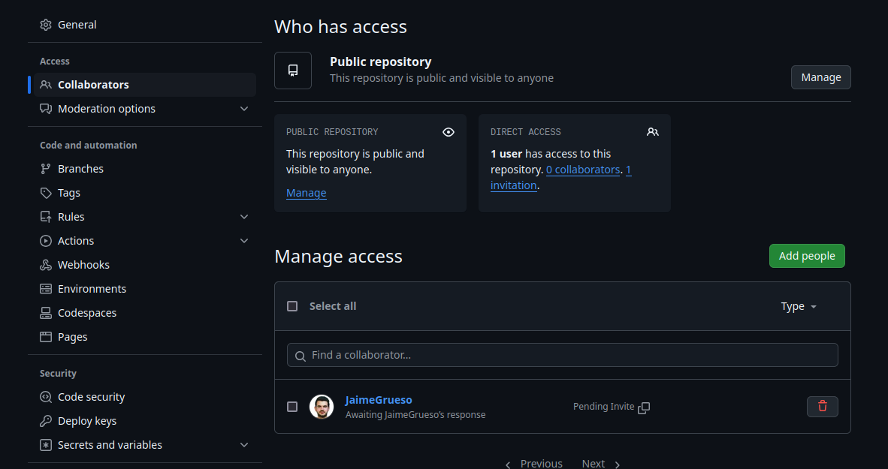

## Crea una rama v0.2

Para ello debemos de usar el comando `git checkout -b v0.2`

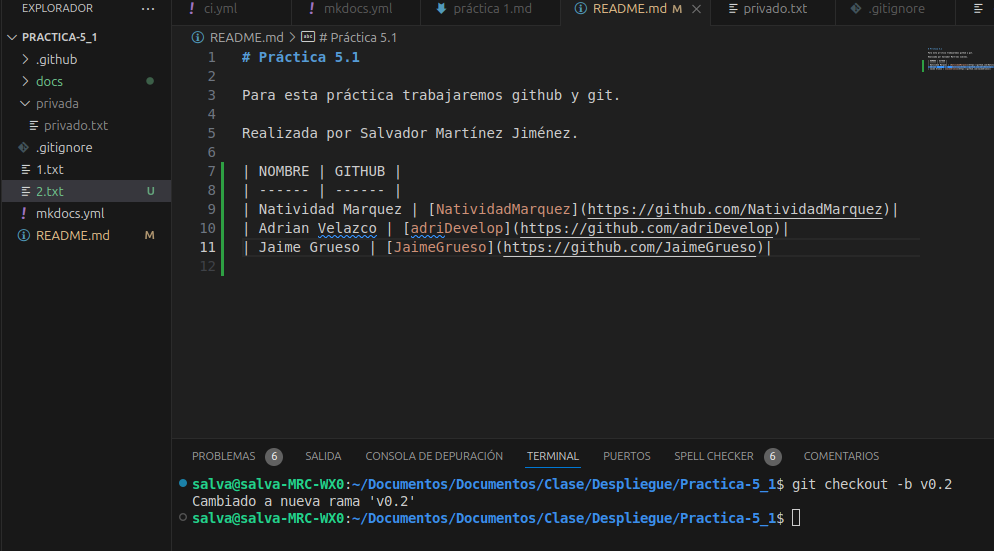

## Añadir fichero 2.txt y creamos la rama remota

Creamos el fichero 2.txt y lo añadimos al repositorio. Creamos la rama remota con el comando `git push -u origin v0.2`

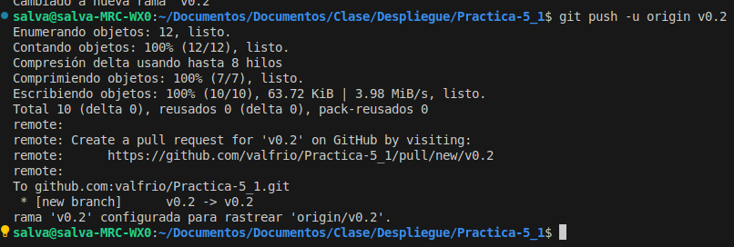

## Merge directo

Para hacer un merge directo debemos de ir a la rama master y hacer el comando `git merge v0.2`

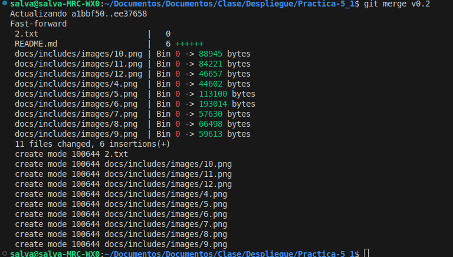

## Merge con conflicto

Crearemos un conflicto en el fichero 1.txt. Para ello, escribimos Hola en la rama master y Adios en la rama v0.2. Ahora debemos de hacer un commit y acto seguido
un merge. Al hacer el merge nos saldrá un conflicto. 

Creación del conflicto:

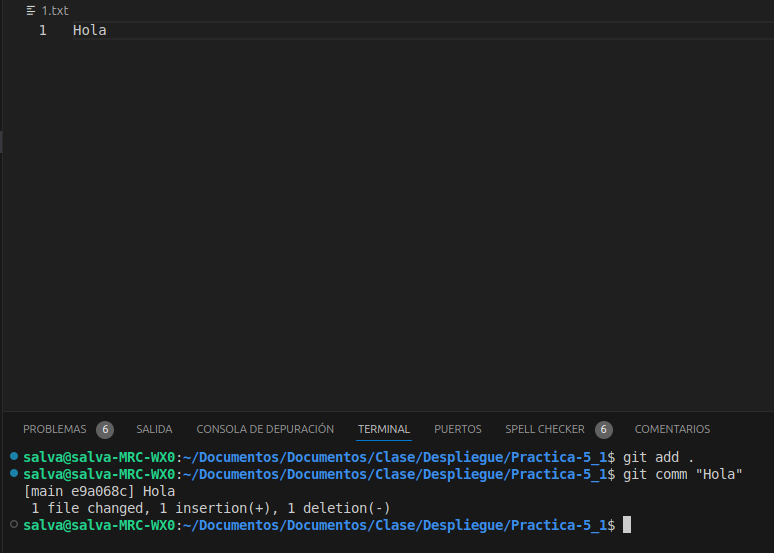

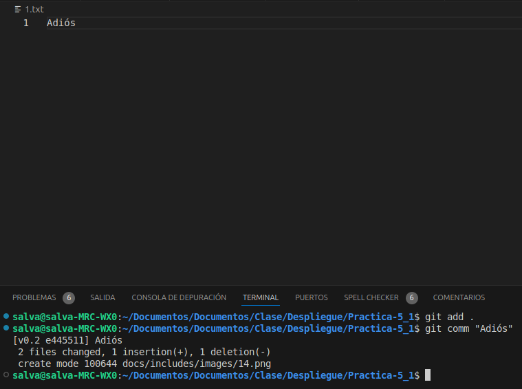

Merge con conflicto:

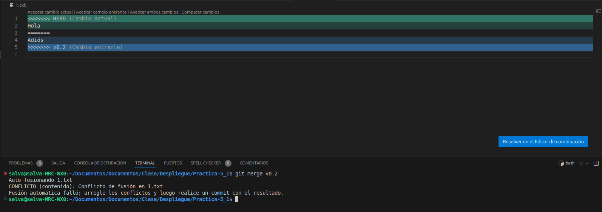

## Listado de ramas

Para listar las ramas debemos de usar el comando `git branch --merged` para ver las ramas que han sido fusionadas y `git branch --no-merged` para ver las que no han sido fusionadas.

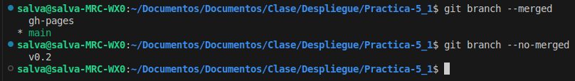

## Arreglar el conflicto

Para arreglar el conflicto debemos de abrir el fichero con conflicto y borrar las lineas que no queremos. Una vez hecho esto debemos de hacer un commit y un push.

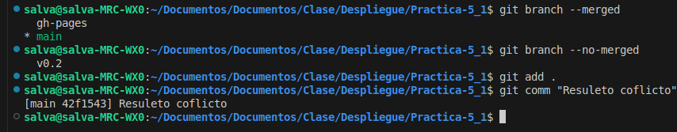

## Borrar rama

Primero creamos un tag con el comando `git tag v0.2` y luego borramos la rama con el comando `git branch -D v0.2`

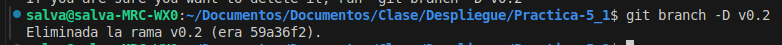

## Listado de cambios

Para ver los cambios que se han hecho en el repositorio debemos de usar el comando `git log --oneline` con más opciones como `--graph` o `--decorate` para verlo de una forma más visual.

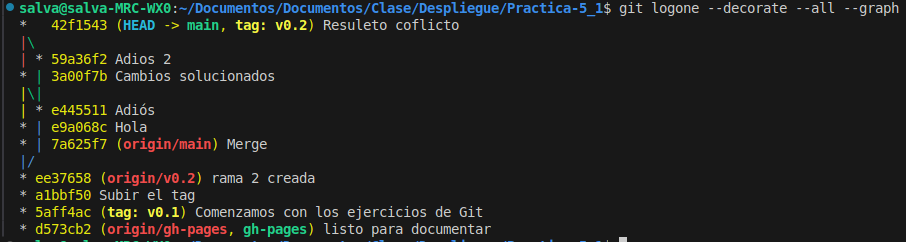
